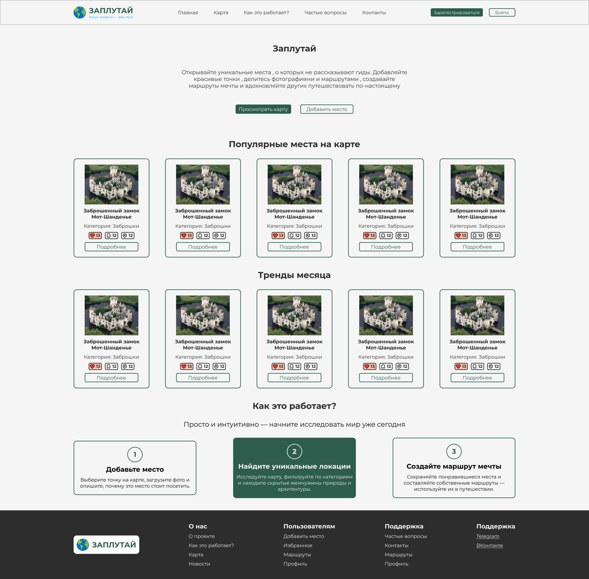
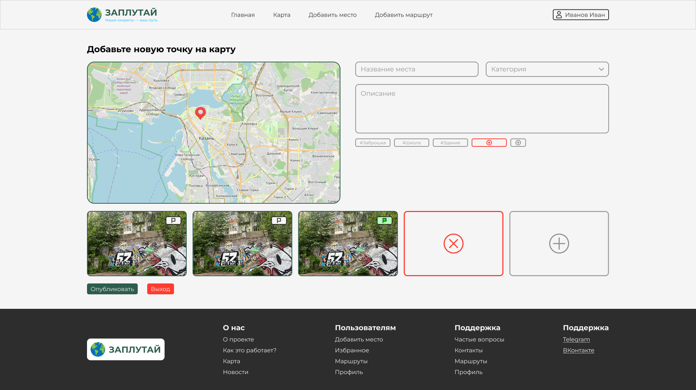

# 🌍 Заплутай

**«Заплутай»** — это веб-платформа, где пользователи делятся **уникальными, скрытыми и красивыми местами**, недоступными на популярных картах (например, Google Maps или Яндекс Карты). Это сообщество искателей приключений, любителей природы и фотографов, желающих открывать мир вне туристических троп.

🔗 [Ссылка на Figma макет](https://www.figma.com/design/53BjyS85x9akFfUmnLoTWf/MapWebSite?node-id=0-1&p=f&t=vKj8v974IHTkiVNJ-0) 

---

## 🎯 О проекте

«Заплутай» — это не просто интерактивная карта. Это **социальная платформа**, которая:
- Позволяет добавлять уникальные места
- Отображает их на карте
- Поддерживает комментарии, лайки и сохранение в избранное
- Предоставляет возможность создания маршрутов

---

## ✅ Возможности сайта

### 1. **Главная страница гостей**

- Название
- Описание
- Геокоординаты
- Категория: Природа / Закаты / Заброшки / Архитектура / Экзотика
- Фотографии (до 5 штук)
- Теги (#водопад, #заброшено и т.д.)

### 2. **Добавление новых мест**

- Название
- Описание
- Геокоординаты
- Категория: Природа / Закаты / Заброшки / Архитектура / Экзотика
- Фотографии (до 5 штук)
- Теги (#водопад, #заброшено и т.д.)

### 3. **Интерактивная карта**
- Отображение всех точек интереса
- Фильтрация по категориям и тегам
- Поиск по названию или координатам

---

## 🔧 Технологии

| Что | Как реализовано |
|-----|------------------|
| Backend | Laravel |
| Frontend |  |
| База данных | MySQL |
| Хранение картинок |  |
| Карта | Leaflet.js + OpenStreetMap |

---

## 🧱 Структура базы данных

```php
// users
id
name
email
password
avatar
created_at
updated_at

// spots
id
name
description
latitude
longitude
category_id
user_id
created_at
updated_at

```
